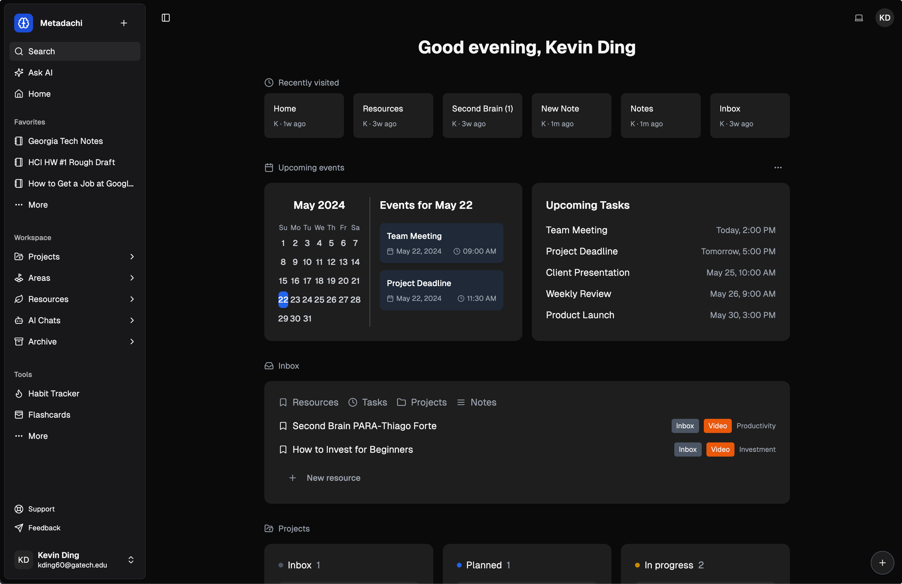

<div align="center">

<h1>Metadachi - AI Second Brain (Prototype)</h1>

We've all felt that sinking frustration of losing an idea or that crucial bit of information—buried in a long-forgotten email, lost in an untitled phone note, or scribbled on a sticky note that’s nowhere to be found. Imagine if you could finally let go of that stress and focus on what really matters. This is why we created Metadachi —a space inspired by Tiago Forte’s "Second Brain" concept, designed to help you capture, organize, and express everything you need, effortlessly. It's more than just organization; it’s freedom for your mind to soar and make room for creativity and purpose.



</div>

## Features
To be continued...

## Planned Features
To be continued...

## Technology Stack
| Technology    | Description                                                                |
|---------------|----------------------------------------------------------------------------|
| Next.js v14   | React framework for server-rendered, statically-generated, & hybrid sites  |
| Vercel        | Streamlined deployment & scaling platform for Next.js apps                 |
| Vercel AI SDK | The AI Toolkit for TypeScript                                              |
| Supabase      | Open source Firebase alternative (Postgres DB, Auth, Storage)              |
| Shadcn        | Beautifully designed components that you can copy and paste into your apps |
| Aceternity UI | Beautiful Tailwind CSS and Framer Motion components                        |

## Deployment Guide
Follow these steps to get your own Metadachi instance running in the cloud with Vercel and Supabase.

### 1. Clone or fork the repo
- Fork: Click the fork button in the upper right corner of the GitHub page.
- Clone: `git clone https://github.com/phanturne/metadachi.git`

### 2. Install dependencies
Open a terminal in the root directory of your local repository and run:
```sh
pnpm install
```

### 3. Set up backend with Supabase
#### a. Create a new project on [Supabase](https://supabase.com/).

#### b. Get project values (save these for later)
1. In the project dashboard, click on the "Project Settings" icon tab on the bottom left.
    - `REFERENCE ID`: found in the "General settings"
2. Click on the "API" tab on the left.
    - `URL`: found in "Project URL"
    - `anon public`: found in "Project API keys"
    - `service_role`: found in "Project API keys"

#### c. Add vault secrets to the "Vault" tab in "Project Settings" page
- `SUPABASE_PROJECT_URL`: Use the `URL` value
- `SUPABASE_SERVICE_ROLE_KEY`: Use the `service_role` value

#### d. Connect database
Open a terminal in the root directory of your local repository and run the following commands. Replace `<project-id>` with the "REFERENCE ID" value.
```sh 
supabase login
supabase link --project-ref <project-id>
supabase db push
```

### 4. Deploy with Vercel
1. Create a new project oon [Vercel](https://vercel.com/)
2. On the setup page, import your GitHub repository for your instance.
3. In the **Environment Variables** section, add entries for the values listed in the [.env.example](.env.example) file.
4. Click "Deploy" and wait for your frontend to deploy.

Once it's up and running, you’ll be able to use your hosted instance of Metadachi via the URL provided by Vercel. Enjoy your new setup!